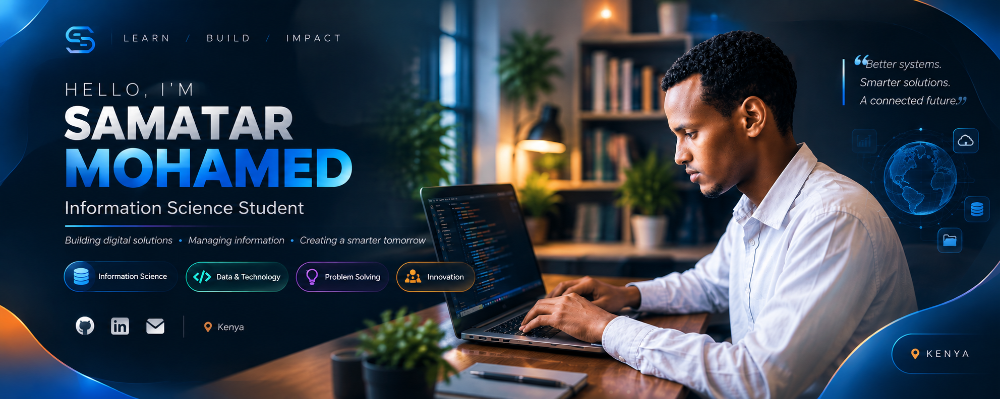

<div align="center">
  
</div>

<br>


<h2 align="center">👋 Hi, I'm Samatar Mohamed</h2>

<p align="center">
  <strong>Full-Stack Developer • Computer Science Student • Problem Solver</strong>
</p>

<p align="center">
  I build practical digital solutions that connect technology with real-world problems.
</p>

<p align="center">
  <a href="https://github.com/samatar578">
    
  </a>
 <a href="https://www.linkedin.com/in/samatar-mohamed-8069a8333/">
  
</a>
  <a href="mailto:YOUR_EMAIL">
    
  </a>
</p>

---

## 👨🏾‍💻 About Me

I'm a Computer Science student and developer who enjoys turning ideas into useful,
modern and accessible software.

- 🌍 Based in **Kenya**
- 💻 Focused on **Full-Stack Web Development**
- 🧠 Learning and improving every day
- 🚀 Building real-world projects
- 🎨 Interested in clean UI/UX
- 🤝 Open to collaboration and meaningful technology projects

---

## 🚀 Featured Projects

### 🌍 WildNorth Kenya

A conservation initiative focused on protecting wildlife and habitats in northern
Kenya through community engagement, technology and education.

**Focus:** Wildlife reporting • Sightings • Conservation education • Community participation

**Technologies:** `React` `JavaScript` `Vite` `Tailwind CSS`

---

### 🚨 Horn Watch

A disaster and community alert platform focused on emergency reporting,
real-time alerts and responder coordination across the Horn of Africa.

**Focus:** Emergency alerts • Reporting • Responders • Maps • Multilingual support

**Technologies:** `React` `JavaScript` `Vite` `Tailwind CSS`

---

### 🛡️ SafePath Youth Hub

A youth awareness platform focused on addiction awareness, peer pressure,
mental health awareness and the risks of irregular migration.

**Technologies:** `HTML` `CSS` `JavaScript`

---

## 🛠️ Tech Stack

### Languages

<p>

</p>

### Frontend

<p>

</p>

### Database & Backend

<p>

</p>

### Tools

<p>

</p>

---

## 🎯 Currently Focused On

```text
Full-Stack Development
      ↓
React & JavaScript
      ↓
Python & SQL
      ↓
UI/UX
      ↓
Real-World Projects
      ↓
Cloud & DevOps