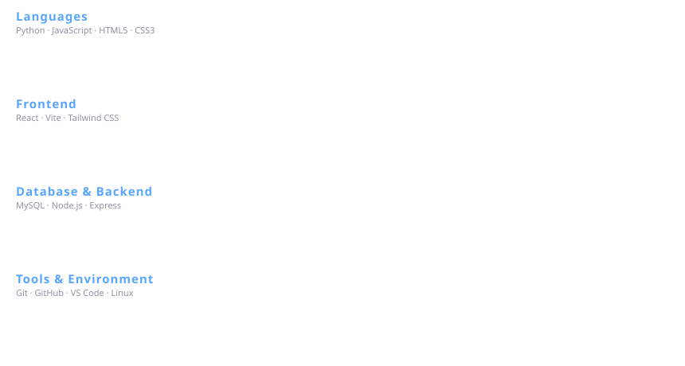

<div align="center">

  

  <br><br>

  <h1>Hi, I'm Samatar Mohamed 👋</h1>

  <p>
    <strong>Information Science Student&nbsp;•&nbsp;Full-Stack Developer&nbsp;•&nbsp;Problem Solver</strong>
  </p>

  <p>
    I build practical digital solutions that connect technology, information,
    and real-world problems — with a focus on community-driven impact.
  </p>

  <br>

  <a href="https://github.com/samatar578">
    
  </a>
  <a href="https://www.linkedin.com/in/samatar-mohamed-8069a8333/">
    
  </a>
  <a href="mailto:samatar578@gmail.com">
    
  </a>

  <br><br>

  

</div>

<br>

## 📌 Table of Contents

- [About Me](#-about-me)
- [What I Do](#-what-i-do)
- [Featured Projects](#-featured-projects)
- [Technology Stack](#️-technology-stack)
- [GitHub Stats](#-github-stats)
- [Currently Focused On](#-currently-focused-on)
- [Let's Connect](#-lets-connect)

<br>

## 👨🏾‍💻 About Me

I'm an **Information Science student and developer** based in Kenya,
interested in building useful digital solutions that combine technology,
information, data, and user-centered design.

- 🎓 Studying **Information Science**
- 💻 Focused on **full-stack web development**
- 🧠 Continuously learning and sharpening my technical skills
- 🚀 Building real-world projects and digital solutions
- 🎨 Interested in **UI/UX** and user-centered design
- 🗄️ Exploring databases, information systems, and data
- 🌱 Passionate about using technology to solve practical community problems
- 🤝 Open to collaboration and meaningful technology projects

<br>

## 🧩 What I Do

<div align="center">

| 💻 Development | 🗄️ Information Systems | 🎨 Design | 🚀 Innovation |
|:---:|:---:|:---:|:---:|
| Web Applications | Databases | UI/UX | Real-World Solutions |
| Frontend Engineering | Data Management | User Experience | Community Technology |
| Backend Engineering | Information Architecture | Accessibility | Digital Innovation |

</div>

<br>

## 🚀 Featured Projects

### 🌍 WildNorth Kenya
A conservation initiative focused on protecting wildlife and habitats in
northern Kenya through community engagement, technology, and education.

**Focus:** Wildlife reporting · Sightings tracking · Conservation education · Community participation · Information sharing

`React` `JavaScript` `Vite` `Tailwind CSS`

---

### 🚨 Horn Watch
A disaster and community alert platform for emergency reporting, real-time
alerts, community coordination, and responder communication across the
Horn of Africa.

**Focus:** Emergency alerts · Disaster reporting · Location & maps · Community coordination · Multilingual support · Mobile-first experience

`React` `JavaScript` `Vite` `Tailwind CSS`

---

### 🛡️ SafePath Youth Hub
A youth awareness platform providing information on addiction, peer
pressure, mental health, and the risks of irregular migration.

**Focus:** Youth awareness · Addiction awareness · Peer pressure · Personal development · Irregular migration awareness · Educational resources

`HTML` `CSS` `JavaScript`

<br>

## 🛠️ Technology Stack

<div align="center">
  
</div>

<br>

## 📊 GitHub Stats

<div align="center">

  
  

  <br>

  

</div>

<br>

## 🎯 Currently Focused On

<div align="center">

```text
╭───────────────────────────────╮
│      FULL-STACK DEVELOPMENT    │
╰────────────────┬────────────────╯
                  ↓
╭───────────────────────────────╮
│       REACT & JAVASCRIPT       │
╰────────────────┬────────────────╯
                  ↓
╭───────────────────────────────╮
│          PYTHON & SQL          │
╰────────────────┬────────────────╯
                  ↓
╭───────────────────────────────╮
│             UI / UX            │
╰────────────────┬────────────────╯
                  ↓
╭───────────────────────────────╮
│       REAL-WORLD PROJECTS      │
╰────────────────┬────────────────╯
                  ↓
╭───────────────────────────────╮
│         CLOUD & DEVOPS         │
╰───────────────────────────────╯
```

</div>

<br>

## 🤝 Let's Connect

<div align="center">

  I'm always open to collaborating on meaningful projects, especially ones
  with real community impact. Feel free to reach out!

  <br><br>

  <a href="https://github.com/samatar578">
    
  </a>
  <a href="https://www.linkedin.com/in/samatar-mohamed-8069a8333/">
    
  </a>
  <a href="mailto:samatar578@gmail.com">
    
  </a>

  <br><br>

  <sub>⭐️ Thanks for stopping by — feel free to explore my repositories!</sub>

</div>